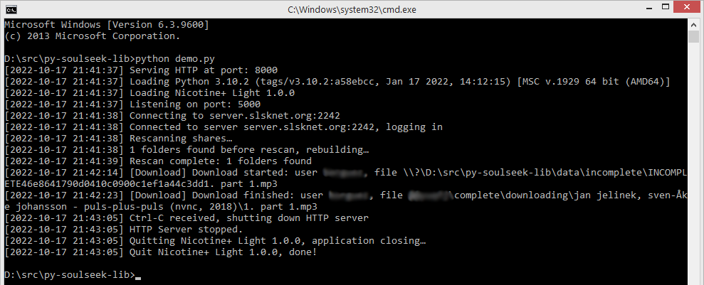

# py-soulseek-lib

py-soulseek-lib is an attempt to turn the [Nicotine+](https://github.com/nicotine-plus/nicotine-plus) code into a reusable Python3 library. It's based on some slimmed-down and adjusted parts of the Nicotine+ v3.2.5 code, and currently only supports search, transfers and shares.

**Requirements (lib)**

* Python 3.x
* pip install semidbm

**Requirements (demo webapp)**

* pip install pymediainfo

**Usage (demo webapp)**

* Open config.ini in text editor and fill "login" and "passw" in section "[server]" with your soulseek credentials
* python demo.py
* Then open http://localhost:8000/ in your browser
* Check out the context menu (right/ctrl click) for various functions. Typing ctrl+space toggles collapsed state in all tree views
* For a real-world web application, create a systemd service for the Python app and use nginx or apache as SSL proxy to support serving via HTTPS

**Screenshots**

*Demo webapp in Windows CMD shell*  

*Demo webapp in browser*  

